# NeoRAG: Advanced Retrieval-Augmented Generation System
Hệ thống NeoRAG được thiết kế với kiến trúc RAG tiên tiến, tích hợp nhiều kỹ thuật tối ưu hóa để nâng cao hiệu suất retrieval và generation.

## 📊 Sơ đồ kiến trúc

```mermaid
graph TD
    A[User Query]
    A --> B["Query Expansion
    • Synonym Expansion
    • Context-Aware Expansion"]
    B --> C["Embedding Model
    halobiron/bge-m3-embedding-PROPTIT-domain-ft
    (sentence-transformers)"]
    C --> D["Vector Database:
    ChromaDB"]
    D --> E[Retrieve Results]
    E --> F["Re-ranking
    halobiron/ViRanker-PROPTIT-domain-ft"]
    F --> G["Context Fusion & LLM Generation
    writer/palmyra-med-70b"]
    G --> H[Final Answer]
```  

## 🎯 Giới thiệu về kiến trúc

**NeoRAG** là hệ thống RAG (Retrieval-Augmented Generation) được tối ưu hóa đặc biệt cho domain câu lạc bộ lập trình ProPTIT. Hệ thống kết hợp nhiều kỹ thuật tiên tiến:

### 🔧 Các thành phần chính:

1. **Query Expansion Module**: Mở rộng câu truy vấn với 2 kỹ thuật chính
4. **ProPTIT-Optimized Embedding and Reranking**: 2 mô hình được fine-tune cho domain ProPTIT
5. **Optimized LLM Generation**: NVIDIA với prompts tối ưu cho domain ProPTIT️

### 🚀 Kỹ thuật Query Expansion:

- **Synonym Expansion**: Mở rộng với từ đồng nghĩa và cách diễn đạt khác từ domain-specific keywords
- **Context-Aware Expansion**: Mở rộng dựa trên ngữ cảnh CLB ProPTIT với template-based patterns

## 📈 Benchmark Results

### 🏋️ Retrieval Metrics - Train Data (100 queries)

| Metric | k=3 | k=5 | k=7 |
|--------|-----|-----|-----|
| **Hit@k** | 0.95 | 0.99 | 0.99 |
| **Recall@k** | 0.85 | 0.94 | 0.95 |
| **Precision@k** | 0.55 | 0.37 | 0.27 |
| **F1@k** | 0.67 | 0.54 | 0.43 |
| **MAP@k** | 0.85 | 0.79 | 0.78 |
| **MRR@k** | 0.86 | 0.82 | 0.81 |
| **NDCG@k** | 0.88 | 0.85 | 0.84 |
| **Context Precision@k** | 0.90 | 0.66 | 0.66 |
| **Context Recall@k** | 0.68 | 0.56 | 0.54 |
| **Context Entities Recall@k** | 0.77 | 0.83 | 0.84 |

### 🤖 LLM Answer Metrics - Train Data

| Metric | k=3 | k=5 | k=7 |
|--------|-----|-----|-----|
| **String Presence@k** | 0.73 | 0.74 | 0.73 |
| **ROUGE-L@k** | 0.25 | 0.26 | 0.24 |
| **BLEU-4@k** | 0.05 | 0.06 | 0.05 |
| **Groundedness@k** | 0.94 | 0.95 | 0.95 |
| **Response Relevancy@k** | 0.82 | 0.82 | 0.82 |
| **Noise Sensitivity@k** | 0.16 | 0.15 | 0.14 |

### 🎯 Retrieval Metrics - Test Data (30 queries)

| Metric | k=3 | k=5 | k=7 |
|--------|-----|-----|-----|
| **Hit@k** | 0.97 | 0.97 | 0.97 |
| **Recall@k** | 0.82 | 0.89 | 0.91 |
| **Precision@k** | 0.53 | 0.37 | 0.28 |
| **F1@k** | 0.65 | 0.52 | 0.42 |
| **MAP@k** | 0.89 | 0.84 | 0.82 |
| **MRR@k** | 0.89 | 0.86 | 0.85 |
| **NDCG@k** | 0.91 | 0.88 | 0.87 |
| **Context Precision@k** | 0.96 | 0.75 | 0.78 |
| **Context Recall@k** | 0.93 | 0.69 | 0.72 |
| **Context Entities Recall@k** | 0.93 | 0.95 | 0.97 |

### 🤖 LLM Answer Metrics - Test Data

| Metric | k=3 | k=5 | k=7 |
|--------|-----|-----|-----|
| **String Presence@k** | 0.85 | 0.85 | 0.85 |
| **ROUGE-L@k** | 0.58 | 0.58 | 0.57 |
| **BLEU-4@k** | 0.37 | 0.37 | 0.36 |
| **Groundedness@k** | 1.00 | 1.00 | 1.00 |
| **Response Relevancy@k** | 0.81 | 0.82 | 0.81 |
| **Noise Sensitivity@k** | 0.02 | 0.02 | 0.01 |

## ✨ Điểm nổi bật (Điểm mạnh)

### 🔥 Kỹ thuật:
- **Domain-specific Query Expansion**: 3 kỹ thuật mở rộng query với từ khóa chuyên biệt cho CLB ProPTIT
- **Fine-tune Embedding & Reranking**: 2 mô hình được fine-tune sao cho phù hợp với domain PROPTIT
- **Hybrid Retrieval Pipeline**: Kết hợp retrieval ban đầu + reranking với scoring tối ưu

### 🌟 Hiệu suất vượt trội:
- Hiệu suất retrieval & generation ổn định trên cả tập train và test với 15+ metrics
- Độ groundedness và relevancy cao (groundedness@3 đạt 1.0 trên test)

### 🇻🇳 Tối ưu tiếng Việt:
- **Domain-Specific Keywords**: Bộ từ khóa chuyên biệt cho lĩnh vực giáo dục và CLB ProPTIT
- **Context-Aware Expansion**: Hiểu ngữ cảnh văn hóa và thuật ngữ Việt Nam
- **Optimized Prompts**: Prompts được thiết kế phù hợp với phong cách giao tiếp tiếng Việt

## ⚠️ Hạn chế

### 🐌 Hiệu suất:
 - **Độ trễ cao**: Yêu cầu GPU cho latency thấp; CPU đơn lẻ có thể chậm

### 🎯 Độ chính xác:
- **Domain Dependency**: Hiệu suất giảm khi áp dụng cho domain khác ngoài ProPTIT

### 🔧 Kỹ thuật:
- **Model Dependency**: Phụ thuộc vào chất lượng của external models (BAAI, ViRanker)
- **Debugging Complexity**: Kiến trúc phức tạp làm khó debug và maintain

### 📊 Evaluation:
- **Subjective evaluation**: Thiếu đánh giá human evaluation

## 🛠️ Technical Stack

### 📦 Core Dependencies:
- **Embedding**: `sentence-transformers`, `BAAI/bge-m3`, `FlagEmbedding`
- **Vector DB**: `chromadb`, `qdrant-client`, `pymongo` (Multi-database support)
- **Reranking**: `FlagEmbedding`, `namdp-ptit/ViRanker` (Vietnamese-optimized)
- **LLM Integration**: `requests` (NVIDIA API)
- **Query Expansion**: Custom implementation với domain-specific keywords
- **Metrics**: Comprehensive evaluation với 15+ metrics
- **Document Processing**: `python-docx`, `pandas`, `numpy`